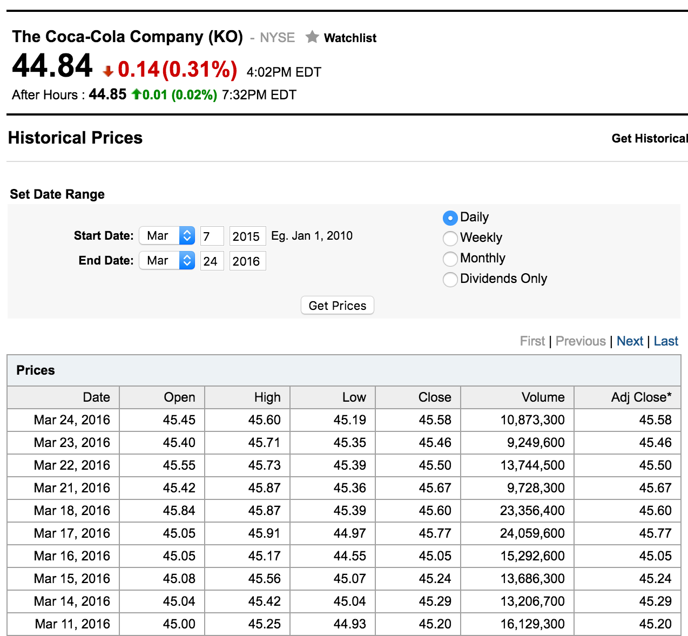

Absolutely Relative Team:    

Claire Asselstine, Mikaela Klein, Sara Kianian, Jerome Rufin, and Ethan Xu

--- &twocol 

## Determinants of Stock Pricing

*** =left
### Data

Screenshot of Coca Cola Data from Yahoo News



*** =right
### Key Question:

* What are the factors that affect stock market trneds in specific industries based on economic time periods and financial reporting?  
 
 
### Possible Determinants of Stock Fluctuations:

* Earnings Reports
* Industry Type
* Significant Historial Events

--- &twocol

## Earnings Reports
```{r echo = FALSE, message = FALSE}
library(DataComputing); library(quantmod); library(scales)
```
*** =left
Coca Cola
```{r echo = FALSE, fig.width=8, fig.height=4}
tableQ3 <- read.csv("/Users/MikaelaKlein/Downloads/table (3).csv", header = TRUE)
tableQ3$Date <- lubridate::ymd(tableQ3$Date)
x <- tableQ3    
x$Change <- ifelse(x$Close > x$Open, "up", "down")
x$Width <- x$Volume / 10^2
ggplot(x, aes(x=Date))+
    geom_linerange(aes(ymin=Low, ymax=High)) +
    theme_bw() +
    labs(title="CandleStick Chart for Coca Cola 3rd Quarter") +
    geom_rect(aes(xmin = Date - Width/2 * 1, 
                  xmax = Date + Width/2 * 1, 
                  ymin = pmin(Open, Close), 
                  ymax = pmax(Open, Close), 
                  fill = Change), alpha = 0.6) + 
    guides(fill = FALSE, colour = FALSE) + 
    scale_fill_manual(values = c("down" = "red3", "up" = "limegreen")) + 
    geom_vline(xintercept = as.numeric(tableQ3$Date[32]))

tableall <- read.csv("/Users/MikaelaKlein/Downloads/table (6).csv", header = TRUE)
tableall$Date <- lubridate::ymd(tableall$Date)
tableall %>% ggplot(aes(x = Date, y = Close)) +
    geom_point() +
    geom_vline(xintercept = c(as.numeric(tableall$Date[234]), as.numeric(tableall$Date[171]), as.numeric(tableall$Date[107]), as.numeric(tableall$Date[32]))) +
    stat_smooth(se=FALSE, method = "loess", span =.4, color = "deepskyblue") +
    labs(title = "Coca Cola 2015-2016 Earnings")
```

*** =right
Apple
```{r echo = FALSE, fig.width=8, fig.height=4}
apple_stocks3 <- read.csv("/Users/MikaelaKlein/Downloads/apple3.csv")
apple_stocks3$Date <- lubridate::dmy(apple_stocks3$Date)
apple_stocks3$Volume <- gsub(",", "", apple_stocks3$Volume)
apple_stocks3$Volume <- as.numeric(apple_stocks3$Volume)
x <- apple_stocks3    
x$Change <- ifelse(x$Close > x$Open, "up", "down")
x$Width <- x$Volume / 10^2
ggplot(x, aes(x=Date))+
    geom_linerange(aes(ymin=Low, ymax=High)) +
    theme_bw() +
    labs(title="CandleStick Chart for Apple 3rd Quarter") +
    geom_rect(aes(xmin = Date - Width/2 * 0.4, 
                  xmax = Date + Width/2 * 0.4, 
                  ymin = pmin(Open, Close), 
                  ymax = pmax(Open, Close), 
                  fill = Change), alpha = 0.6) + 
    guides(fill = FALSE, colour = FALSE) + 
    scale_fill_manual(values = c("down" = "red3", "up" = "limegreen"))

apple_stocks5 <- read.csv("/Users/MikaelaKlein/Downloads/apple1-4.csv", head = TRUE)
apple_stocks5$Date = lubridate::dmy(apple_stocks5$Date)
ggplot(data=apple_stocks5,aes(x=Date,y=Close)) + geom_point() + geom_vline(xintercept = as.numeric(apple_stocks5$Date[33]) )+ stat_smooth(se = FALSE, method = "loess", span=.4, color = "deepskyblue") + labs(title = "Apple Year Closing Values", y = "Closing Daily Stock Value") +  geom_vline(xintercept = as.numeric(apple_stocks5$Date[223]) )+  geom_vline(xintercept = as.numeric(apple_stocks5$Date[161]) ) + geom_vline(xintercept = as.numeric(apple_stocks5$Date[102]) ) 
```

--- &twocol

*** =left
## Industry Type
```{r echo = FALSE, warning = FALSE}
Industry <- read.csv("/Users/MikaelaKlein/Downloads/49_Industry_Portfolios.csv")
monthly_returns<- Industry[1:1075,]
library(stringr); library(DataComputing)
returns_modified<- monthly_returns %>% mutate(date = X)
returns_modified$year<- as.numeric(str_extract(returns_modified$date, "^([[:digit:]]{4})"))
returns_modified$month<- as.numeric(str_extract(returns_modified$date, "([[:digit:]]{2})$"))
returns_modified$date<- paste( returns_modified$year, returns_modified$month, sep = "-")

recessiontech<- returns_modified[883:905,] #isolate cases corresponding to the dates during the recession period  
recessiontech1<- recessiontech %>% select(date, year, month, Hardw, Softw, Books, Fin, Paper) #select only the industries I want to look at 

recessiontech1$Date<- as.Date(paste(recessiontech1$date, "-01", sep ="")) #format the date so it can look nice in the graoh

narrowrectech<- recessiontech1 %>% gather(key= Industry, value= Avg_Weighted_Returns, Softw, Hardw, Books, Paper, Fin) #format the data frame so it is tidy/narrow

recession<- rep(c("recession"), times = 115)
narrowrectech<- narrowrectech %>% mutate(status = recession) #add in whether it was recession or recovery period


recovtech<- returns_modified[906:965,] #isolate dates for recovery period 
recovtech1<- recovtech %>% select(date, year, month, Hardw, Softw, Books, Fin, Paper)
#same steps as before 
recovtech1$Date<- as.Date(paste(recovtech1$date, "-01", sep =""))

narrowrecovtech<- recovtech1 %>% gather(key= Industry, value= Avg_Weighted_Returns, Softw, Hardw, Books, Paper, Fin)

recovery<- rep(c("recovery"), times = 300)
narrowrecovtech<- narrowrecovtech %>% mutate(status = recovery)

narrowtechall<- rbind(narrowrecovtech, narrowrectech) #now combind recession and recovery into one data frame 

dotcomplot<- narrowtechall %>% 
    ggplot(aes(x= Date, y= as.numeric(Avg_Weighted_Returns))) +
    geom_line(aes(color= Industry, group= 1)) + 
    scale_x_date(date_labels = "%Y-%m") + 
    facet_grid(Industry ~ status) + 
    theme_linedraw() + 
    theme(axis.ticks.y= element_line(color= "black")) + 
    ylim(-15, 15) +
    geom_hline(yintercept = 0, alpha=0.25) + 
    ylab("Monthly Average Weighted Returns") + 
    xlab("Date")+ labs(title= "Dot Com Boom")

print(dotcomplot) #plot data frame 
```
Growth rates of industries in recent recession and recoveries

*** =right
## Historical Events
```{r echo = FALSE}
mydata = read.csv("/Users/MikaelaKlein/Downloads/IndustryPortfolios-1.csv")
mydata <-
  mydata %>%
  mutate(fillerColumn = rep("01",1074)) %>%
  mutate(Date = paste(Date,fillerColumn,sep=""))

newData <-
  select(mydata,-fillerColumn) %>%
  mutate(Date = ymd(Date))

newData1 <- newData %>% select(Date, Oil, Autos, Ships, Mach, Util) %>%
    gather(key = Industry, value = Value, -Date, -Oil)

newData1 %>%
    ggplot(aes(x = Oil, y = Value)) +
    geom_point() +
    geom_smooth(method = "lm", se = FALSE) +
    facet_grid(Industry~.) + 
    labs(title = "Oil vs. Other Industries Historically")
```
Correlation between monthly growth rates of industries historically


