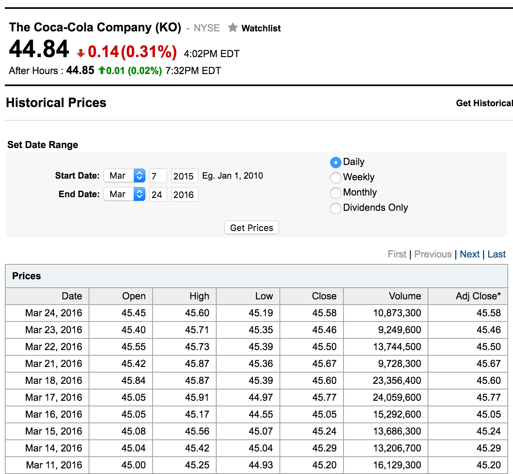
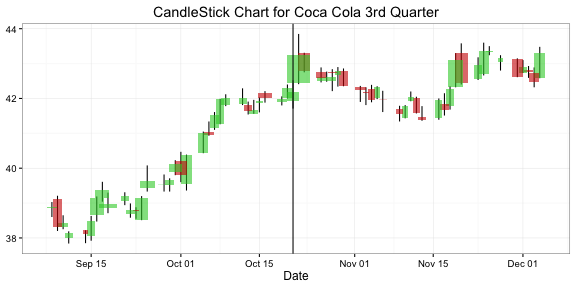
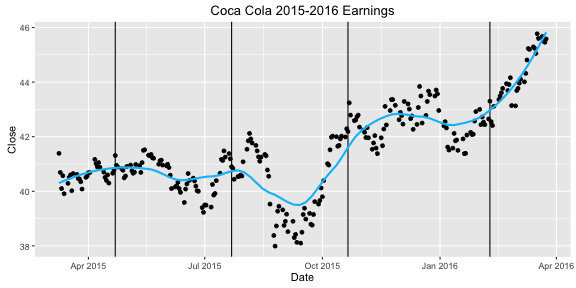
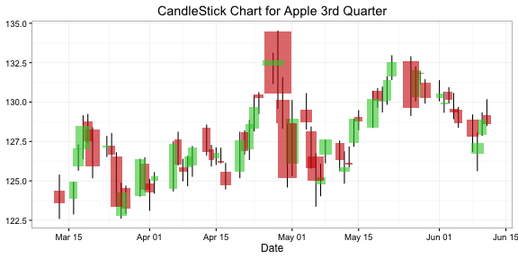
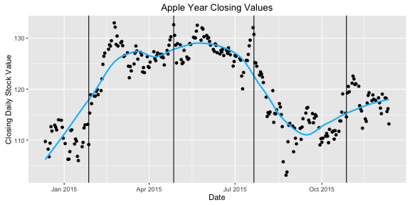
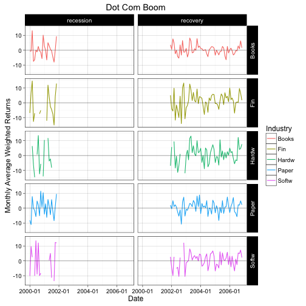
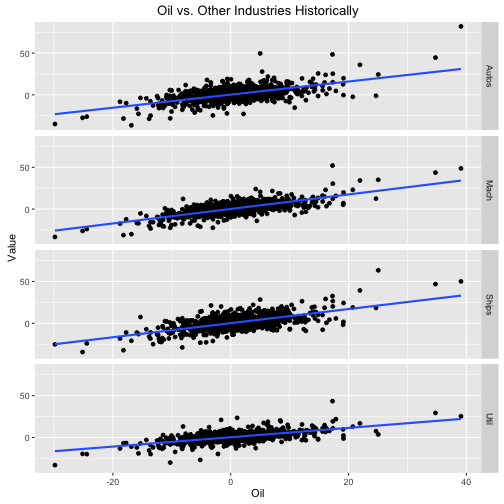

Absolutely Relative Team:    

Claire Asselstine, Mikaela Klein, Sara Kianian, Jerome Rufin, and Ethan Xu

--- &twocol 

## Determinants of Stock Pricing

*** =left
### Data

Screenshot of Coca Cola Data from Yahoo News

*** =right
### Key Question:

* What are the factors that affect stock market trneds in specific industries based on economic time periods and financial reporting?  
 
 
### Possible Determinants of Stock Fluctuations:

* Earnings Reports
* Industry Type
* Significant Historial Events

--- &twocol

## Earnings Reports

*** =left
Coca Cola

*** =right
Apple

--- &twocol

*** =left
## Industry Type

Growth rates of industries in recent recession and recoveries

*** =right
## Historical Events

Correlation between monthly growth rates of industries historically

